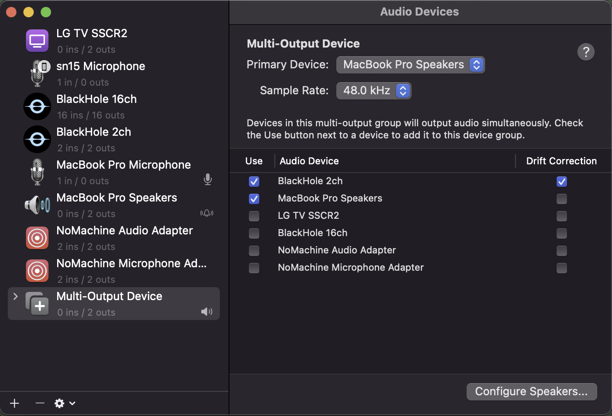
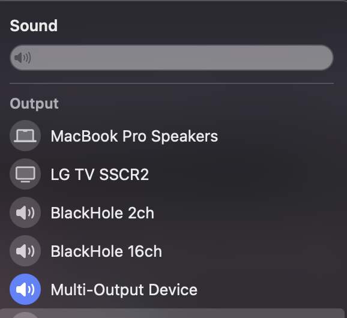
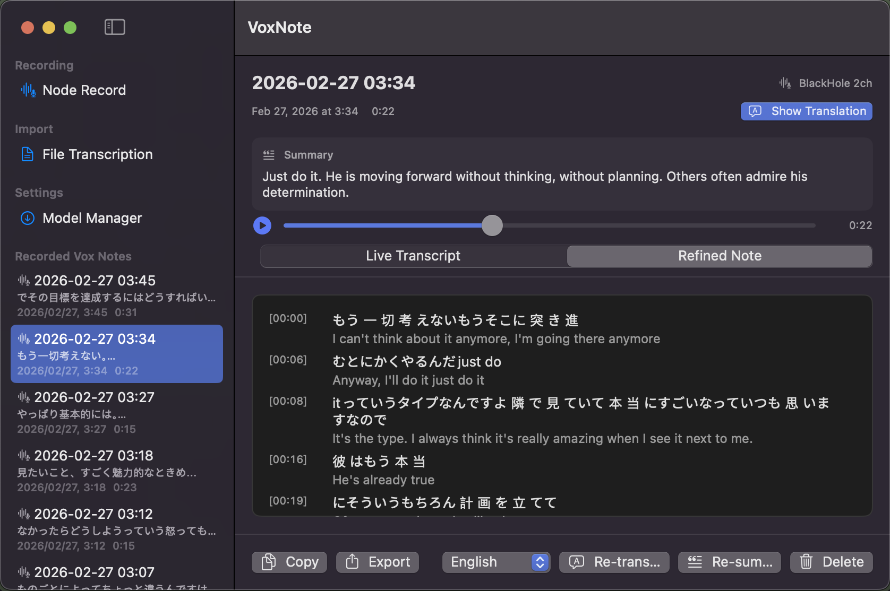

# VoxNote

VoxNote is a macOS app for turning audio into clear notes.

## Main Features

- Record from microphone or system audio.
- Import audio files and transcribe them quickly.
- Generate a live transcript and a refined note view.
- Translate, re-summarize, and manage outputs in one place.
- Review past recordings with playback and export tools.

## How to Use

1. Install BlackHole from the official repo:  
   https://github.com/ExistentialAudio/BlackHole
2. Open **Audio MIDI Setup** and create a **Multi-Output Device**.

3. In the Multi-Output Device settings, check **BlackHole 2ch** and your speaker/headphones output.

4. Set that Multi-Output Device as your macOS sound output.

5. Start VoxNote and select the created output device as the recording source.

